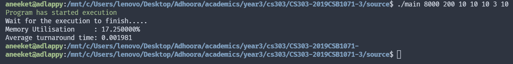

# CS303 Assignment 3
Submitter name: Aneeket Mangal\
Roll No.: 2019CSB1071\
Course:  CS303

## 1. What does this program do
* This C program tries to explore and understand the relative effectiveness of the first-fit, best-fit, and next-fit algorithms memory placement based on dynamic partitioning. 
* Following metrics would be calculated during the execution of the program.
    * Memory utilization (%age of the total physical memory actually used)
    * Average turnaround time. The turnaround time is the time it takes for successfully allocating the requested amount of memory to a process.
* There are 7 constants during the execution of the program
    * p (size of the memory)
    * q (size of operating system)
    * n (process arrival rate is a random number between (0.1n, 1.2n) per second)
    * m (size s of the processes are random between (0.5m, 3.0m) MB)
    * t (durations d range from (0.5t, 6.0t) minutes in multi­ples of 5 seconds)
    * type of allocation
    * T (Total duration of program execution)

## 2. A description of how this program works 
* ```generatorThread``` spawns process at process arrival rate with random duration and size requirements and puts them into a waiting queue.
* ```simulatorThread``` looks for a waiting process in the queue, dequeues it and allocates memory to it and creates a new thread which run the waiting process for given duration.
* In case where the memory cannot be allocated to a process waots while its allocated.
* Memory allocation is done on the basis of the CLI input (first-fit, best-fit, and next-fit).
* ```interruptThread``` waits for T time and exits the program after that.
* **CLARIFICATIONS**
    * Request queue is linked list based and has infinite capacity (theoratically).
    * Process waits until a allocation is found.

## 3. How to compile and run this program
* Navigate to ```source``` directory inside main directory.
* Compile using ```gcc main.c -o main -pthread -lm```.
* Run the program using ```./main [p] [q] [m] [n] [t] [allocation type] [T (seconds)]```.
* A sample example would be ```./main 8000 200 10 10 10 2 10```
* Unit tests can be found in the ```test``` directory.
* Observation tables are present in the ```observation``` directory.
---
**NOTE**

| INDEX | ALLOCATION TYPE | DESCRIPTION |
|-------|-----------------|-------------|
| 1     | FIRST-FIT       | In this algorithm, first free memory block is allocated to a process. |
| 2     | BEST-FIT        | In this algorithm, memory block that has best fit (```blockSize-processSize``` is minimum) is allocated to a process.|
| 3     | NEXT-FIT        |  In this algorithm, next free block to previously allocated block is allocated to the process.|
---


**ANALYSIS AND OBSERVATIONS**
* All the simulations have been run for 1000 seconds.
* Observation tables are present in ```observation``` folder.
* Observation files are in .md format.
* From the data we can observe that:
    * Average Turnaround time for ```first fit``` algorithm is around 250 seconds and average memory util is around 91%.
    * Average Turnaround time for ```next fit``` algorithm is around 300 seconds and average memory util is around 93%.
    * Average Turnaround time for ```best fit``` algorithms is around 325 seconds and average memory util is around 93%.
    From this data we can conclude that:
    * First fit > Next Fit > Best Fit (in terms of effectiveness)
    * ```First fit``` is the best algorithm followed by next fit followed by best fit.
    * This practical data verifies the theoratical data.

## 4. Provide a snapshot of a sample run



