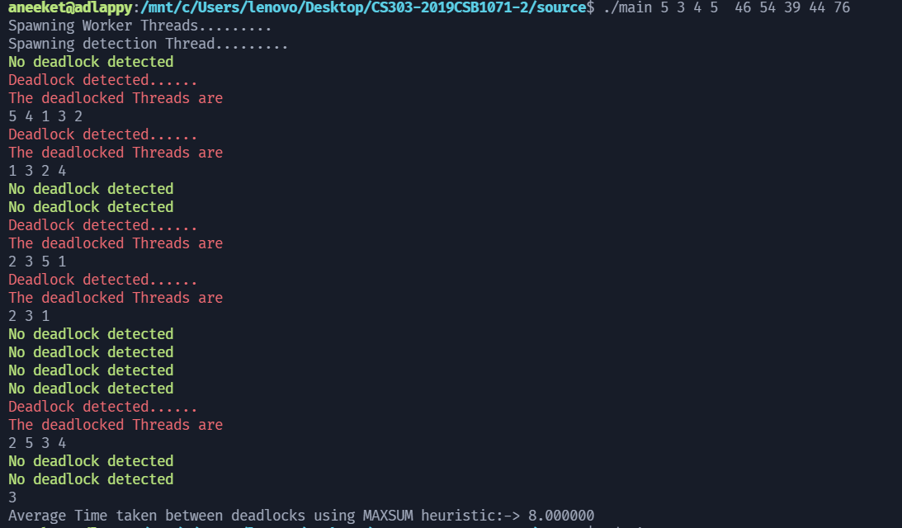

# CS303 Assignment 2
Submitter name: Aneeket Mangal\
Roll No.: 2019CSB1071\
Course:  CS303

## 1. What does this program do
This C program simulates:
 * Resource requests by threads/processes
 * Resource allocation by OS
 * Deadlock detection 
 * Thread termination (terminating some thread involved in the deadlock).
 * Analyzing various heuristic techniques for thread termination.

## 2. A description of how this program works 
* There are ```THREAD_COUNT``` POSIX threads representing threads/process in a OS system.
* Each thread first decide random amount of resource instances for each resource type(also chosen randomly) it  would require during the execution of the program.
* Then it would request random amount of resource instances of a random resource type from the system at random intervals (1 seconds to 4 seconds) and if resources are available, 
it would be granted other wise the thread will do busy waiting.
* Once the threads complete execution (all the requests have been served), it would terminate and a new thread will be respawned after a duration of (0.7d to 1.5d).
* There is one thread to detect deadlock and if a deadlock is detected, 
it would apply required heuristic and termiante (preempt) a deadlocked thread.
* Also there is one interrupt thread, that wait for user to interrupt the program. And once its interrupted, it shows the average time between detected deadlocks during the execution of the program.
* Terminated threads are respawned again after a duration of (0.7d to 1.5d).
* There are 3 types of heuristics for thread termination:
    1. ```RANDOM```: terminates a random thread
    2. ```MINSUM```: terminates thread with max resource allocation
    3. ```MAXSUM```: terminates thread with min resource allocation
* User can provide heuristic arguement using CLI.


## 3. How to compile and run this program
* Navigate to ```source``` directory inside main directory.
* Compile using ```gcc main.c -o main -pthread```.
* Run the program using ```./main [thread count] [heuristic index (0 to run all and compare)] [detection interval] [resource count] [max instances of resources (separated by spaces)]```.
* A sample example would be ```./main 5 0 4 6 26 15 14 19 13 6```
* To stop running the program input any number and enter on the terminal.
---
**NOTE**

| HEURISTIC INDEX | HEURISTIC TYPE | HEURISTIC DESCRIPTION                                                                                                                                                          |
|-----------------|----------------|--------------------------------------------------------------------------------------------------------------------------------------------------------------------------------|
| 0               | ALL            | Runs all heuristics and provides heuristic with maximum time between deadlocks and minimum time between deadlocks. User has to interrupt 3 times to run each type of heuristic |
| 1               | RANDOM         | This heuristic terminates a random thread                                                                                                                                      |
| 2               | MINSUM         | This heuristic terminates thread with minimum resource allocation                                                                                                              |
| 3               | MAXSUM         | This heuristic terminates thread with maximum resource allocation                                                                                                              |
---
## 4. Provide a snapshot of a sample run
* Terminal output of a sample run (on all three heuristics) can be found in the ```test``` directory. 
* The sample runs lasted for 1000 seconds for each heuristic and here are the compiled results
for average time between deadlocks.

| HEURISTIC INDEX | HEURISTIC TYPE | Average time (Test 1) | Average Time (Test 2) | Average ((A1+A2)/2) |
|-----------------|----------------|-----------------------|-----------------------|---------------------|
| 1               | RANDOM         | 8.845485              | 7.402985              | 8.124235            |
| 2               | MINSUM         | 8.591304              | 7.878481              | 8.234895            |
| 3               | MAXSUM         | 8.925806              | 9.920000              | 9.422500            |

Here we can cleary see that:
* Minimum average time between deadlocks is taken by ```RANDOM```
* Maximum average time between deadlocks is taken by ```MAXSUM```
* However, results might vary for different sample runs (as it is a probabilistic program)

Snapshot of a sample run


